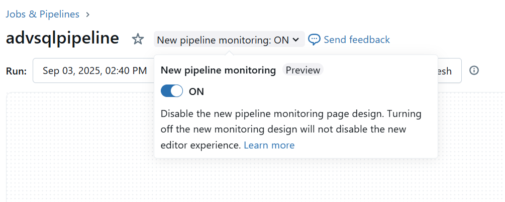

## Build an ETL Pipeline with Lakeflow Declarative Pipelines
Learn how to build and deploy an ETL (Extract, Transform, Load) pipeline for data orchestration using **Lakeflow Declarative Pipelines** and **Auto Loader** in Azure Databricks. This tutorial guides you through extracting data, applying transformations (such as data quality checks and de-duplication), and loading processed data into a target system like a data warehouse or data lake.

### Tutorial Objectives

- **Ingest** raw source data into a target table.
- **Transform** the raw data and write results to materialized views.
- **Query** the transformed data.
- **Automate** the ETL pipeline using a Databricks job.

### Prerequisites

Ensure you have:

- Access to an Azure Databricks workspace.
- Unity Catalog enabled.
- Serverless compute enabled (Lakeflow Declarative Pipelines may not be available in all regions).
- Permissions to create/access compute resources, schemas, and volumes.

---
### Enable the New Pipeline Monitoring UI

You can enable a streamlined pipeline monitoring UI as part of the Lakeflow Pipelines Editor beta. The new monitoring UI is on by default when the beta is enabled.

**To enable and use the new monitoring UI:**

1. Click **Jobs & Pipelines** in the Databricks workspace sidebar.
2. Click the name of any pipeline to open its details page.
3. At the top of the page, use the **New pipeline page** toggle to enable the updated monitoring UI.

> The UI will show both beta features when enabled. If you turn off the new monitoring UI, the page will highlight any changes.



#### Step 1: Create a Pipeline

Create an ETL pipeline in Lakeflow Declarative Pipelines:

1. In your workspace, click **Jobs & Pipelines** in the sidebar.
2. Under **New**, select **ETL Pipeline**.
3. Enter a unique pipeline name.
4. Select **Serverless**.
5. Choose a Catalog and enter a new Schema name.
6. Click **Create**.

A pipeline UI will appear for your new pipeline.

---

#### Step 2: Develop a Pipeline

Use Databricks Notebooks (Python or SQL) to develop and validate source code for Lakeflow Declarative Pipelines. Auto Loader is used for incremental data ingestion.

**Python Example:**

```python
# Import modules
import dlt
from pyspark.sql.functions import *
from pyspark.sql.types import DoubleType, IntegerType, StringType, StructType, StructField

# Define the path to the source data
file_path = f"/databricks-datasets/songs/data-001/"

# Define a streaming table to ingest data from a volume
schema = StructType(
  [
    StructField("artist_id", StringType(), True),
    StructField("artist_lat", DoubleType(), True),
    StructField("artist_long", DoubleType(), True),
    StructField("artist_location", StringType(), True),
    StructField("artist_name", StringType(), True),
    StructField("duration", DoubleType(), True),
    StructField("end_of_fade_in", DoubleType(), True),
    StructField("key", IntegerType(), True),
    StructField("key_confidence", DoubleType(), True),
    StructField("loudness", DoubleType(), True),
    StructField("release", StringType(), True),
    StructField("song_hotnes", DoubleType(), True),
    StructField("song_id", StringType(), True),
    StructField("start_of_fade_out", DoubleType(), True),
    StructField("tempo", DoubleType(), True),
    StructField("time_signature", DoubleType(), True),
    StructField("time_signature_confidence", DoubleType(), True),
    StructField("title", StringType(), True),
    StructField("year", IntegerType(), True),
    StructField("partial_sequence", IntegerType(), True)
  ]
)

@dlt.table(
  comment="Raw data from a subset of the Million Song Dataset; a collection of features and metadata for contemporary music tracks."
)
def songs_raw():
  return (spark.readStream
    .format("cloudFiles")
    .schema(schema)
    .option("cloudFiles.format", "csv")
    .option("sep","\t")
    .load(file_path))

# Define a materialized view that validates data and renames a column
@dlt.table(
  comment="Million Song Dataset with data cleaned and prepared for analysis."
)
@dlt.expect("valid_artist_name", "artist_name IS NOT NULL")
@dlt.expect("valid_title", "song_title IS NOT NULL")
@dlt.expect("valid_duration", "duration > 0")
def songs_prepared():
  return (
    spark.read.table("songs_raw")
      .withColumnRenamed("title", "song_title")
      .select("artist_id", "artist_name", "duration", "release", "tempo", "time_signature", "song_title", "year")
  )

# Define a materialized view that has a filtered, aggregated, and sorted view of the data
@dlt.table(
  comment="A table summarizing counts of songs released by the artists who released the most songs each year."
)
def top_artists_by_year():
  return (
    spark.read.table("songs_prepared")
      .filter(expr("year > 0"))
      .groupBy("artist_name", "year")
      .count().withColumnRenamed("count", "total_number_of_songs")
      .sort(desc("total_number_of_songs"), desc("year"))
  )
```

**SQL Example:**

```sql
-- Define a streaming table to ingest data from a volume
CREATE OR REFRESH STREAMING TABLE songs_raw
COMMENT "Raw data from a subset of the Million Song Dataset; a collection of features and metadata for contemporary music tracks."
AS SELECT *
FROM STREAM read_files(
  '/databricks-datasets/songs/data-001/part*',
  format => "csv",
  header => "false",
  delimiter => "\t",
  schema => """
    artist_id STRING,
    artist_lat DOUBLE,
    artist_long DOUBLE,
    artist_location STRING,
    artist_name STRING,
    duration DOUBLE,
    end_of_fade_in DOUBLE,
    key INT,
    key_confidence DOUBLE,
    loudness DOUBLE,
    release STRING,
    song_hotnes DOUBLE,
    song_id STRING,
    start_of_fade_out DOUBLE,
    tempo DOUBLE,
    time_signature INT,
    time_signature_confidence DOUBLE,
    title STRING,
    year INT,
    partial_sequence STRING
  """,
  schemaEvolutionMode => "none");

-- Define a materialized view that validates data and renames a column
CREATE OR REFRESH MATERIALIZED VIEW songs_prepared(
CONSTRAINT valid_artist_name EXPECT (artist_name IS NOT NULL),
CONSTRAINT valid_title EXPECT (song_title IS NOT NULL),
CONSTRAINT valid_duration EXPECT (duration > 0)
)
COMMENT "Million Song Dataset with data cleaned and prepared for analysis."
AS SELECT artist_id, artist_name, duration, release, tempo, time_signature, title AS song_title, year
FROM songs_raw;

-- Define a materialized view that has a filtered, aggregated, and sorted view of the data
CREATE OR REFRESH MATERIALIZED VIEW top_artists_by_year
COMMENT "A table summarizing counts of songs released by the artists each year, who released the most songs."
AS SELECT
  artist_name,
  year,
  COUNT(*) AS total_number_of_songs
FROM songs_prepared
WHERE year > 0
GROUP BY artist_name, year
ORDER BY total_number_of_songs DESC, year DESC
```

---

#### Step 3: Run and Monitor the Pipeline

1. Click **Start** in the pipeline UI to run your pipeline.
2. Monitor progress and check for errors in the UI.
3. Validate that tables and views (`songs_raw`, `songs_prepared`, `top_artists_by_year`) are created and populated.
4. Troubleshoot issues by reviewing logs and updating code as needed.
5. Optionally, schedule recurring pipeline runs using Databricks Jobs.

---

#### Step 4: Query the Transformed Data

Use Databricks SQL Editor to analyze the processed data.

**Example Query 1:** Find artists who released the most songs each year since 1990.

```sql
-- Which artists released the most songs each year in 1990 or later?
SELECT artist_name, total_number_of_songs, year
FROM <catalog>.<schema>.top_artists_by_year
WHERE year >= 1990
ORDER BY total_number_of_songs DESC, year DESC
```
Replace `<catalog>` and `<schema>` with your catalog and schema names.

**Example Query 2:** Find songs with a 4/4 beat and danceable tempo.

```sql
-- Find songs with a 4/4 beat and danceable tempo
 SELECT artist_name, song_title, tempo
 FROM <catalog>.<schema>.songs_prepared
 WHERE time_signature = 4 AND tempo between 100 and 140;
```
Replace `<catalog>` and `<schema>` as needed.

---

#### Step 5: Automate and Schedule Pipeline Runs

1. In the workspace, go to **Jobs & Pipelines**.
2. Click **New** > **Job**.
3. Name your job and task (e.g., "Songs workflow", "ETL_songs_data").
4. Set **Type** to Pipeline and select your pipeline.
5. Click **Create** and **Run Now** to execute.
6. To schedule, add a trigger in the Schedules & Triggers panel, set the period and time zone, and click **Save**.

Monitor job runs and review outputs in the UI.

