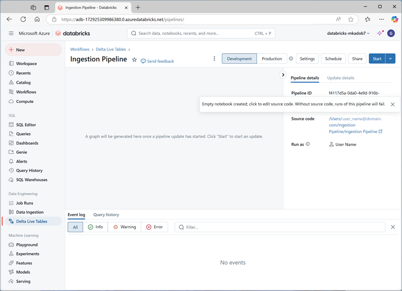

---
lab:
    title: 'End-to-End Streaming Pipeline with Delta Live Tables in Azure Databricks'
---

# End-to-End Streaming Pipeline with Delta Live Tables in Azure Databricks

Creating an end-to-end streaming pipeline with Delta Live Tables in Azure Databricks involves defining transformations on data, which Delta Live Tables then manage through task orchestration, cluster management, and monitoring. This framework supports streaming tables for handling data that is continuously updated, materialized views for complex transformations, and views for intermediate transformations and data quality checks.


> **Note**: The Azure Databricks user interface is subject to continual improvement. The user interface may have changed since the instructions in this exercise were written.

## Provision an Azure Databricks workspace

## Create a notebook and ingest data

1. In the sidebar, use the **(+) New** link to create a **Notebook**. In the **Connect** drop-down list, select your cluster if it is not already selected. If the cluster is not running, it may take a minute or so to start.
2. Change the default notebook name (**Untitled Notebook *[date]***) to **Delta Live Tables Ingestion**.

3. In the first cell of the notebook, enter the following code, which uses *shell* commands to download data files from GitHub into the file system used by your cluster.

     ```python
    import urllib.request

    url = "https://raw.githubusercontent.com/parveenkrraina/essilor-batch02/refs/heads/main/Day-08/device_data.csv"
    dbfs_path = "/device_stream/device_data.csv"

    # Download the file to DBFS
    dbutils.fs.cp(url, dbfs_path, recurse=True)
     ```

4. Use the **&#9656; Run Cell** menu option at the left of the cell to run it. Then wait for the Spark job run by the code to complete.

## Use delta tables for streaming data

Delta lake supports *streaming* data. Delta tables can be a *sink* or a *source* for data streams created using the Spark Structured Streaming API. In this example, you'll use a delta table as a sink for some streaming data in a simulated internet of things (IoT) scenario. In the next task, this delta table will work as a source for data transformation in real time.

1. In a new cell, run the following code to create a stream based on the folder containing the csv device data:

     ```python
    from pyspark.sql.functions import *
    from pyspark.sql.types import *

    # Define the schema for the incoming data
    schema = StructType([
        StructField("device_id", StringType(), True),
        StructField("timestamp", TimestampType(), True),
        StructField("temperature", DoubleType(), True),
        StructField("humidity", DoubleType(), True)
    ])

    # Read streaming data from folder
    inputPath = '/device_stream/'
    iotstream = spark.readStream.schema(schema).option("header", "true").csv(inputPath)
    print("Source stream created...")

    # Write the data to a Delta table
    query = (iotstream
             .writeStream
             .format("delta")
             .option("checkpointLocation", "/tmp/checkpoints/iot_data")
             .start("/tmp/delta/iot_data"))
     ```

2. Use the **&#9656; Run Cell** menu option at the left of the cell to run it.

This delta table will now become the source for data transformation in real time.

   > Note: The code cell above creates the source stream. Therefore, the job run will never change to a completed status. To manually stop streaming, you can run `query.stop()` in a new cell.
   
## Create a Delta Live Table Pipeline

A pipeline is the main unit for configuring and running data processing workflows with Delta Live Tables. It links data sources to target datasets through a Directed Acyclic Graph (DAG) declared in Python or SQL.

1. Select **Jobs & Pipelines** in the left sidebar and then select **ETL**.

2. In the **Create pipeline** page, create a new pipeline with the following settings:
    - **Pipeline name**: `Ingestion Pipeline`
    - **Product edition**: Advanced # Select Premium if available
    - **Pipeline mode**: Triggered
    - **Source code**: *Leave blank*
    - **Storage options**: Unity Catalog
    - **Default Catalog**: As per your setup
    - **Target schema**: As per your setup

3. Select **Create** to create the pipeline (which will also create a blank notebook for the pipeline code).

4. Once the pipeline is created, open the link to the blank notebook under **Source code** in the right-side panel. This opens the notebook in a new browser tab:

    

5. In the first cell of the blank notebook, enter (but don't run) the following code to create Delta Live Tables and transform the data:

     ```python
    import dlt
    from pyspark.sql.functions import col, current_timestamp
     
    @dlt.table(
        name="raw_iot_data",
        comment="Raw IoT device data"
    )
    def raw_iot_data():
        return spark.readStream.format("delta").load("/tmp/delta/iot_data")

    @dlt.table(
        name="transformed_iot_data",
        comment="Transformed IoT device data with derived metrics"
    )
    def transformed_iot_data():
        return (
            dlt.read("raw_iot_data")
            .withColumn("temperature_fahrenheit", col("temperature") * 9/5 + 32)
            .withColumn("humidity_percentage", col("humidity") * 100)
            .withColumn("event_time", current_timestamp())
        )
     ```

6. Close the browser tab containing the notebook (the contents are automatically saved) and return to the pipeline. Then select **Start**.

7. After the pipeline has successfully completed, go back to the recent **Delta Live Tables Ingestion** that you created first, and verify that the new tables have been created in the specified storage location by running the following code in a new cell:

     ```sql
    %sql
    SHOW TABLES in catalog01.stream
     ```

## View results as a visualization

After creating the tables, it is possible to load them into dataframes and visualize the data.

1. In the first notebook, add a new code cell and run the following code to load the `transformed_iot_data` into a dataframe:

    ```python
    %sql
    SELECT * FROM catalog01.stream.transformed_iot_data # Update catalog and schema as per ypur setup
    ```

1. Above the table of results, select **+** and then select **Visualization** to view the visualization editor, and then apply the following options:
    - **Visualization type**: Line
    - **X Column**: timestamp
    - **Y Column**: *Add a new column and select* **temperature_fahrenheit**. *Apply the* **Sum** *aggregation*.

1. Save the visualization and view the resulting chart in the notebook.
1. Add a new code cell and enter the following code to stop the streaming query:

    ```python
    query.stop()
    ```
    

## Clean up

In Azure Databricks portal, on the **Compute** page, select your cluster and select **&#9632; Terminate** to shut it down.

If you've finished exploring Azure Databricks, you can delete the resources you've created to avoid unnecessary Azure costs and free up capacity in your subscription.
