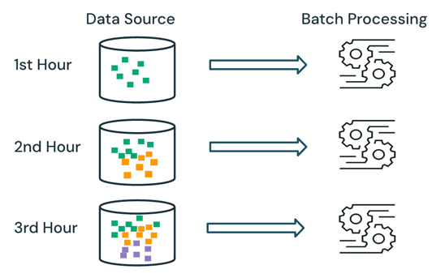
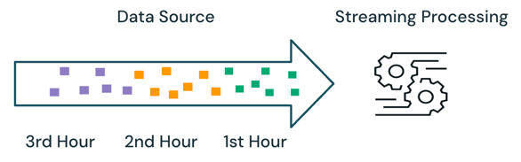

# Procedural vs. Declarative Data Processing

Procedural and declarative programming are two core paradigms for structuring data workflows. Each approach influences pipeline complexity, maintainability, and efficiency.

### Procedural Data Processing

Procedural data processing follows a structured approach where explicit steps are defined to manipulate data. This model is closely aligned with imperative programming, emphasizing a command sequence that dictates how the data should be processed

**Characteristics:**
   - Step-by-step execution: The developer explicitly defines the order of operations.
   - Use of control structures: Loops, conditionals, and functions manage execution flow.
   - Detailed resource control: Enables fine-grained optimizations and manual performance tuning.
   - Related concepts: Procedural programming is a sub-class of imperative programming.

**Common Use Cases:**
- Custom ETL pipelines requiring procedural logic.
- Low-level performance optimizations in batch and streaming workflows.
- Legacy systems or existing imperative scripts.

**Procedural processing with Apache Spark and Lakeflow Jobs**  

Apache Spark primarily follows a procedural model for data processing. Use Lakeflow Jobs to add explicit execution logic to define step-by-step transformations and actions on distributed data.

### Declarative Data Processing

Declarative data processing abstracts the how and focuses on defining the desired result. Instead of specifying step-by-step instructions, developers define transformation logic, and the system determines the most efficient execution plan.

**Characteristics:**
- Abstraction of execution details: Users describe the desired outcome, not the steps to achieve it.
- Automatic optimization: The system applies query planning and execution tuning.
- Reduced complexity: Removes the need for explicit control structures, improving maintainability.
- Related concepts: Declarative programming includes domain-specific and functional programming paradigms.

**Common Use Cases:**
- SQL-based transformations in batch and streaming workflows.
- High-level data processing frameworks such as Lakeflow Declarative Pipelines.
- Scalable, distributed data workloads requiring automated optimizations.

**Declarative processing with Lakeflow Declarative Pipelines**

Lakeflow Declarative Pipelines is a declarative framework designed to simplify the creation of reliable and maintainable stream processing pipelines. By specifying what data to ingest and how to transform it, Lakeflow Declarative Pipelines automates key aspects of pipeline management, including orchestration, compute management, monitoring, data quality enforcement, and error handling.

### Comparison Table

| Aspect         | Procedural Processing                  | Declarative Processing                |
|----------------|---------------------------------------|---------------------------------------|
| Control        | Full control over execution            | System-managed execution              |
| Complexity     | Can be complex and verbose             | Simpler and more concise              |
| Optimization   | Manual tuning required                 | Automatic optimization                |
| Flexibility    | High, requires expertise               | Lower, easier to use                  |
| Use Cases      | Custom pipelines, performance tuning   | SQL queries, managed pipelines        |

### Choosing Between Procedural and Declarative

| When to Choose Procedural                                         | When to Choose Declarative                                |
|-------------------------------------------------------------------|--------------------------------------------------------|
| Fine-grained control over execution logic is required.            | Simplified development and maintenance are priorities. |
| Transformations involve complex business rules that are difficult to express declaratively.                                         | SQL-based transformations or managed workflows eliminate the need for procedural control.                         |
| Performance optimizations necessitate manual tuning.                           | Data processing frameworks such as Lakeflow Declarative Pipelines provide built-in optimizations.                  |

## Triggered vs. Continuous Pipeline Mode

### What is triggered pipeline mode?
In triggered mode, the pipeline processes data and stops after successfully refreshing all tables (or selected tables). Each table is refreshed based on the data available when the update starts.

### What is continuous pipeline mode?
In continuous mode, Lakeflow Declarative Pipelines process new data as it arrives in data sources, keeping tables fresh throughout the pipeline. To avoid unnecessary processing, pipelines monitor dependent Delta tables and update only when their contents change.

| Key Questions                                   | Triggered Mode                                 | Continuous Mode                                         |
|-----------------------------------------------|------------------------------------------------|---------------------------------------------------------|
| When does the update stop?                    | Automatically once complete.                   | Runs continuously until manually stopped.                |
| What data is processed?                       | Data available when the update starts.         | All data as it arrives at configured sources.            |
| What data freshness requirements is this best for? | Data updates run every 10 minutes, hourly, or daily. | Data updates are desired between every 10 seconds and a few minutes. |

---
---

## Batch vs. Streaming Data Processing

### Batch Semantics

With batch processing, the engine does not keep track of what data is already being processed in the source. All of the data currently available in the source is processed at the time of processing. In practice, a batch data source is typically partitioned logically (e.g., by day or region) to limit data reprocessing.

> **Example:**  
> Calculating the average item sales price, aggregated at an hourly granularity, for a sales event run by an e-commerce company can be scheduled as batch processing to calculate the average sales price every hour. With batch, data from previous hours is reprocessed each hour, and the previously calculated results are overwritten to reflect the latest results.

### Streaming Semantics

With streaming processing, the engine keeps track of what data is being processed and only processes new data in subsequent runs. In the example above, you can schedule streaming processing instead of batch processing to calculate the average sales price every hour. With streaming, only new data added to the source since the last run is processed. The newly calculated results must be appended to the previously calculated results to check the complete results.

# Batch vs. Streaming

In the example above, streaming is better than batch processing because it does not process the same data processed in previous runs. However, streaming processing gets more complex with scenarios like out-of-order and late arrival data in the source.

> **Late Arrival Data Example:**  
> If some sales data from the first hour does not arrive at the source until the second hour:
>
> - **Batch Processing:** The late arrival data from the first hour will be processed with data from the second hour and existing data from the first hour. The previous results from the first hour will be overwritten and corrected with the late arrival data.
> - **Streaming Processing:** The late-arriving data from the first hour will be processed without any of the other first-hour data that has been processed. The processing logic must store the sum and count information from the first hour's average calculations to correctly update the previous results.

These streaming complexities are typically introduced when the processing is stateful, such as joins, aggregations, and deduplications.

For stateless streaming processing (e.g., appending new data from the source), handling out-of-order and late arrival data is less complex, as the late arriving data can be appended to the previous results as the data arrives in the source.

---

### Batch vs. Streaming: Pros, Cons, and Product Features

| Processing Semantic | Pros                                                                 | Cons                                                                 | Data Engineering Products                                                                                           |
|---------------------|----------------------------------------------------------------------|----------------------------------------------------------------------|---------------------------------------------------------------------------------------------------------------------|
| **Batch**           | Processing logic is simple. Results are always accurate and reflect all the available data in the source. | Not as efficient; data will be reprocessed in a particular batch partition. Slower, could handle latency requirements from hours to minutes, but not seconds or milliseconds. | Lakeflow Declarative Pipelines materialized view flow and materialized view. Databricks Runtime - Apache Spark (`spark.read.load()` and `spark.write.save()`). |
| **Streaming**       | Efficient, only new data is processed. Faster, could handle latency requirements from hours to minutes, seconds, and milliseconds. | Processing logic could be complex, especially for stateful processing such as joins, aggregations, deduplications, etc. Results can not always be accurate, considering out-of-order and late-arrival data. | Lakeflow Connect. Lakeflow Declarative Pipelines append flow, apply change flow, streaming table, and sink. Databricks Runtime - Spark Structured Streaming (`spark.readStream.load()` and `spark.writeStream.start()`). |

---

### Recommendations

The table below outlines the recommended processing semantics based on the characteristics of the data processing workloads at each layer of the medallion architecture.

| Medallion Layer | Workload Characteristics                                                                 | Recommendation                                                                                                                                                                                                                 |
|-----------------|-----------------------------------------------------------------------------------------|--------------------------------------------------------------------------------------------------------------------------------------------------------------------------------------------------------------------------------|
| **Bronze**      | Ingestion workloads. Typically involves no or stateless processing for incremental append from data sources. The size of data is typically larger. | Streaming processing is generally a better choice, given users can benefit from the advantages of streaming but not get exposed to the complexities of stateful streaming processing.                                           |
| **Silver**      | Transformation workloads. Typically involves both stateless processing such as filtering and stateful processing such as joins, aggregations, and deduplications. | Use batch processing (with incremental refresh in materialized views) to avoid the complexities of stateful streaming processing. Use streaming processing as an option for use cases where efficiency and latency is much more important than results accuracy. Be mindful of the complexities introduced by stateful streaming processing. |
| **Gold**        | Last-mile aggregation workloads. Typically involves stateful processing such as joins and aggregations. The size of data is generally smaller. | Use batch processing (with incremental refresh in materialized views) to avoid the complexities of stateful streaming processing.                                                        |

---
---

